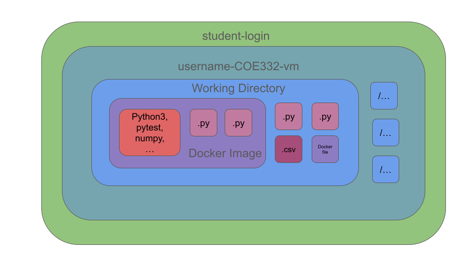

# Meteorite Landings Data Analysis

## Overview

This project aims to provide insights into meteorite landings worldwide by analyzing NASA's provided data through Python. More specifically this explores the top meteorite classes by year, missing data values, and average distance from the equator.

### Scripts
`ml_data_analysis.py`
This script contains the functions used to analyze the meteorite data and the formatted printing statements. Functions include `topClassesByYear()`, `missingValues()`, and `avgDistanceFromEquator()`.

`gcd_algorithm.py`
This script implements the Haversine formula in order to calculate the great circle distance between two points on Earth's surface.

`test_ml_data_analysis.py`
This is the pytest file for `ml_data_analysis.py`.

`test_gcd_algorithm.py`
This is the pytest file for `gcd_algorithm.py`.

### Running the Code
#### Non-Containerized
1. Make sure Python3 is installed on your computer.
2. Download or clone this repository into a directory.
3. Download `Meteorite_Landings_20240205.csv` from https://data.nasa.gov/Space-Science/Meteorite-Landings/gh4g-9sfh/about_data
4. Place this file in the same directory you cloned into.
5. Run the main script (`ml_data_analysis.py`)
#### Containerized
1. Make sure Docker is intalled on your computer
2. Download or clone this repository into a directory.
3. Download `Meteorite_Landings_20240205.csv` from https://data.nasa.gov/Space-Science/Meteorite-Landings/gh4g-9sfh/about_data
4. Place this file in the same directory you cloned into.
5. In the directory, run `docker build -t ml_data_analysis:1.0 .` And wait for the Docker image to generate.
6. In the directory, run `docker run --rm -it -v $PWD/Meteorite_Landings_20240205.csv:/data/Meteorite_Landings_20240205.csv ml_data_analysis:1.0 /bin/bash`
7. Run `cd home`
8. Run `ml_data_analysis.py`

### Interpretation
- The `topClassesByYear` function provides insights into the distribution of meteorite classes over different years. (Default range is 2008-2010 inclusive)
- The `missingValues` function counts the number of missing values for each key in the dataset.
- The `avgDistanceFromEquator` function calculates the average distance of meteorite landings from the equator.
- Any missing values or null entries are thrown out of the calculations.

### Diagram

This diagram shows the hierarchy of the containerized code. `/...` are extraneous directories, `.py` are Python scripts, and `.csv` is the data file which gets dynamically imported into the docker image via step 6 in the containerized instructions.